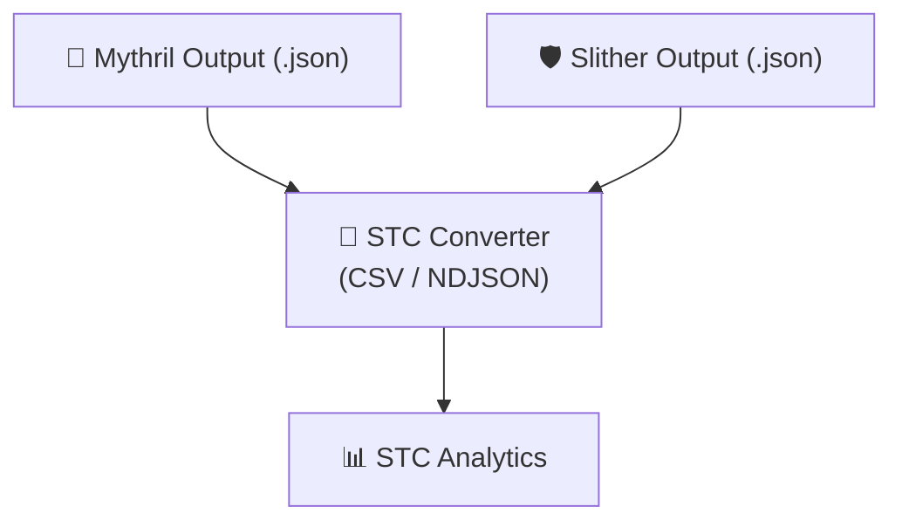

# 🔐 STC for SWC (Smart Contract Weakness Classification)

[](https://doi.org/10.5281/zenodo.16888878)
[](https://stc-converter.streamlit.app/)


[](https://github.com/mrbrightsides/stc-swc/actions/workflows/ping.yml)

STC Converter adalah modul untuk mengubah hasil audit keamanan Smart Contract (via Mythril atau Slither) menjadi format standar STC Analytics, sehingga mudah dieksplorasi, divisualisasikan, dan dikaitkan dengan modul STC lainnya.

---

## ✨ Fitur Utama

- 🛠 Support Tools → Hasil audit dari Mythril & Slither

- 🔄 Auto Converter → Output JSON dikonversi ke:

  `swc_findings.csv`
  `swc_findings.ndjson`

- 📊 Integrasi Analytics → Siap diunggah ke STC Analytics untuk eksplorasi lebih lanjut

- 💻 UI & CLI Mode:

  `Mode UI → via Streamlit App`

  `Mode CLI → via python -m stc_swc.cli`

---

## Quick Start

```bash
pip install -r requirements.txt

# jalankan Mythril/Slither sendiri dulu, simpan output JSON ke outputs/
# contoh:
# myth analyze examples/contracts/SimpleBank.sol -o json > outputs/mythril.json
# slither examples/contracts/SimpleBank.sol --json outputs/slither.json

# UI (Streamlit)
streamlit run app_swc_converter.py

# CLI
python -m stc_swc.cli --tool mythril --input outputs/mythril.json --out-dir outputs
```

---

## 📂 Struktur Output

  `swc_findings.csv → tabel hasil audit dalam format tabular`

  `swc_findings.ndjson → format JSON baris-per-baris untuk pipeline data`

---

## 🔗 Workflow STC Ecosystem



---

## 📜 Lisensi

MIT License © ELPEEF Dev Team
