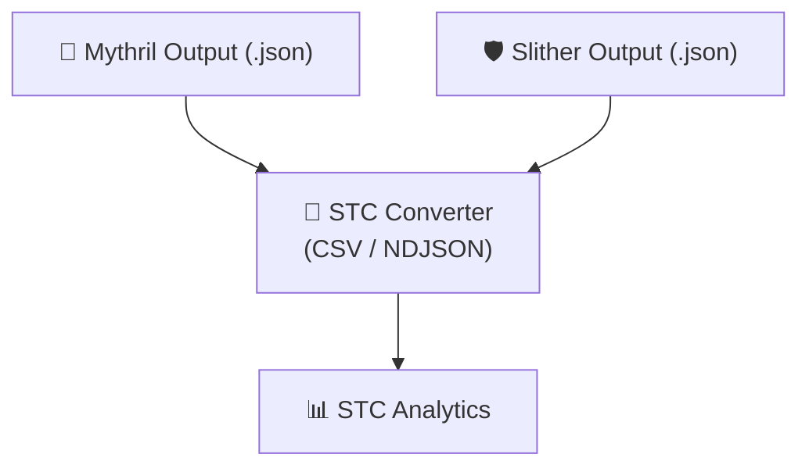

# 🔐 STC for SWC (Smart Contract Weakness Classification)

[](https://doi.org/10.5281/zenodo.16888878)
[](https://stc-converter.streamlit.app/)


[](https://github.com/mrbrightsides/stc-swc/actions/workflows/ping.yml)

STC Converter adalah modul untuk mengubah hasil audit keamanan Smart Contract (via Mythril atau Slither) menjadi format standar STC Analytics, sehingga mudah dieksplorasi, divisualisasikan, dan dikaitkan dengan modul STC lainnya.

---

## ✨ Fitur Utama

- 🛠 Support Tools → Hasil audit dari Mythril & Slither

- 🔄 Auto Converter → Output JSON dikonversi ke:

  `swc_findings.csv`
  `swc_findings.ndjson`

- 📊 Integrasi Analytics → Siap diunggah ke STC Analytics untuk eksplorasi lebih lanjut

- 💻 UI & CLI Mode:

  `Mode UI → via Streamlit App`

  `Mode CLI → via python -m stc_swc.cli`

---

## 📦 Quick Start

```bash
pip install -r requirements.txt

# jalankan Mythril/Slither sendiri dulu, simpan output JSON ke outputs/
# contoh:
# myth analyze examples/contracts/SimpleBank.sol -o json > outputs/mythril.json
# slither examples/contracts/SimpleBank.sol --json outputs/slither.json

# UI (Streamlit)
streamlit run app_swc_converter.py

# CLI
python -m stc_swc.cli --tool mythril --input outputs/mythril.json --out-dir outputs
```

---

## 📂 Struktur Output

  `swc_findings.csv → tabel hasil audit dalam format tabular`

  `swc_findings.ndjson → format JSON baris-per-baris untuk pipeline data`

---

## 🪄 Workflow STC Ecosystem



---

## 🔗 Integrasi STC Ecosystem

STC Converter bukan modul yang berdiri sendiri — hasil konversinya didesain untuk langsung “plug & play” dengan ekosistem STC lain:

- ⚡ STC Analytics → eksplorasi hasil audit, filter severity, heatmap, dashboard interaktif.

- 💸 STC GasVision → gabungkan dengan data biaya gas untuk evaluasi performa kontrak.

- 📊 STC Insight → dashboard insight lintas modul untuk laporan komprehensif.

- 🧪 STC Bench (Dev) → (coming soon) benchmark performa kontrak + integrasi hasil audit.

Dengan integrasi ini, STC Converter jadi jembatan penting antara static analyzer tools dan ekosistem STC.

---

## 📋 Sample Output

Hasil konversi siap dipakai langsung di STC Analytics dengan format standar:

  `finding_id,timestamp,network,contract,file,line_start,line_end,swc_id,title,severity,confidence,status,remediation,commit_hash`
  
  `Mythril::SWC-101::12,2025-08-14T10:22:01.120Z,Sepolia,SimpleBank,SimpleBank.sol,12,20,SWC-101,Arithmetic Overflow,High,0.9,Open,Use SafeMath,0x123abc...`

---

## 🚀 Future Work

- 🔄 Support tambahan untuk tool lain (Oyente, Securify, Manticore).

- 📦 Opsi ekspor ke format lain (Parquet / Feather) untuk big data pipeline.

- 🌐 Integrasi ke STC Insight API untuk otomatisasi laporan audit.

- 📊 Visualisasi dasar (severity pie chart) langsung di UI converter.

---

## 📜 Lisensi

MIT License © ELPEEF Dev Team
